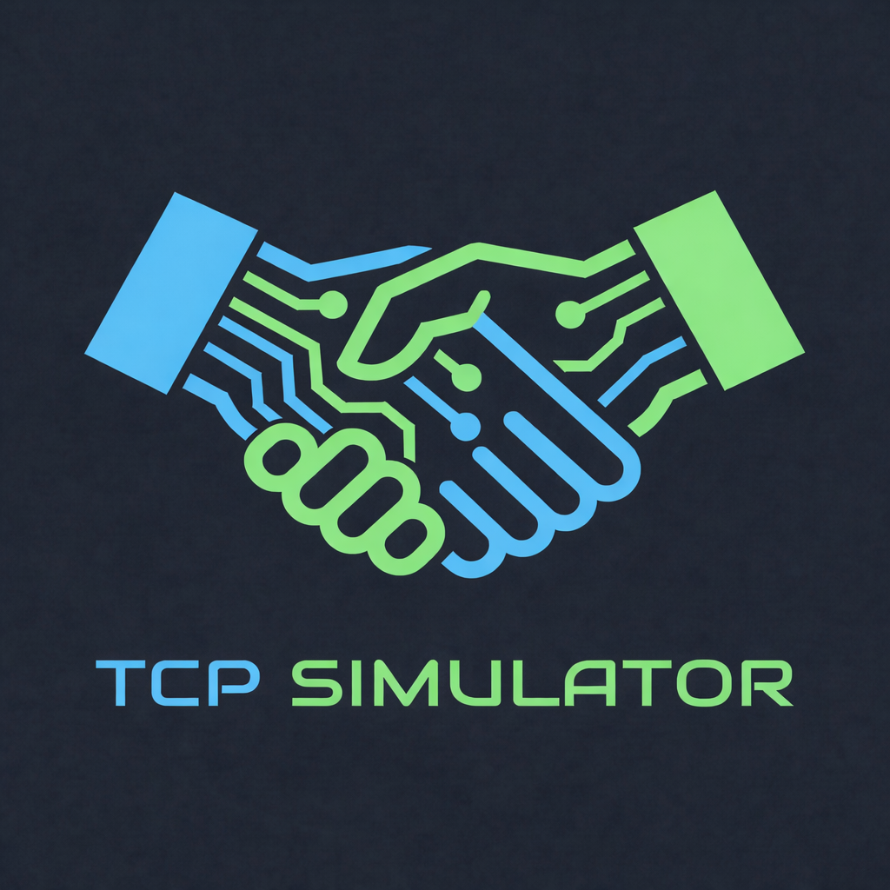

# TCP Simulator 

<p align="center">
  
</p>

## 📌 Sobre o Projeto

O TCP Simulator é uma ferramenta educacional interativa desenvolvida para visualizar e simular o comportamento do protocolo TCP (Transmission Control Protocol). O objetivo é transformar conceitos abstratos de redes de computadores, como *Three-Way Handshake*, controle de fluxo e retransmissão, em uma experiência visual e prática.

O sistema permite que dois usuários se conectem em uma sala virtual e troquem pacotes em tempo real, visualizando a mudança de estados da conexão.

Destaque para o Laboratório de Caos, um modo onde é possível "quebrar" a rede propositalmente (perda de pacotes, corrupção e reordenação) para observar como o protocolo TCP reage e se recupera.

---

## 🔗 Acesso Online

Você pode acessá-lo através do link abaixo:

👉 **[https://tcpsimulator.duckdns.org/](https://tcpsimulator.duckdns.org/)**

> **Nota:** Como o projeto utiliza infraestrutura acadêmica (AWS Academy), o servidor pode estar ocasionalmente offline.

---

## 🎯 Funcionalidades Principais

O simulador vai muito além de uma simples animação, implementando lógicas reais do protocolo:

- **🤝 Conexão Realista:** Simulação completa do *Three-Way Handshake* (SYN, SYN-ACK, ACK) e encerramento (FIN).
- **📦 Inspeção de Pacotes:** Visualização detalhada de cabeçalhos (Portas, Flags, Números de Sequência e ACK).
- **🧪 Laboratório de Caos:** Um ambiente de testes onde o usuário pode:
  - Simular perda de pacotes (Timeouts).
  - Corromper dados (Checksum error).
  - Reordenar pacotes (Buffer de Reordenação visual).
  - Disparar rajadas de dados (Burst).
- **🔄 Buffer de Reordenação:** Visualização gráfica de como o TCP organiza pacotes fora de ordem.
- **🌐 Multiplayer via WebSocket:** Salas privadas para pareamento P2P simulado.

---

## 📖 Justificativa Acadêmica

Este projeto aplica conceitos fundamentais de Redes de Computadores e Sistemas Distribuídos:

- **Máquina de Estados:** Implementação fiel dos estados TCP (`LISTEN`, `SYN_SENT`, `ESTABLISHED`, `TIME_WAIT`, etc.).
- **Comunicação Assíncrona:** Uso de WebSockets para garantir baixa latência na sincronização visual entre clientes.
- **Confiabilidade sobre canal não confiável:** O "Chaos Lab" demonstra como o TCP garante a entrega de dados mesmo em redes instáveis.

---

## 📂 Estrutura do Projeto

A organização dos arquivos segue uma separação clara entre Frontend (Visual) e Backend (Sinalização):
```
/tcp-simulator/
│── index.html           # Ponto de entrada (Single Page Application)
│── favicon.png          # Ícone
│
│── css/                 # Estilização Modular
│   ├── global.css       # Estilos base e reset
│   ├── lobby.css        # Estilos da tela de seleção de salas
│   ├── simulator.css    # Estilos do simulator principal
│   ├── chaos.css        # Estilos do Laboratório de Caos 
│
│── js/
│   ├── app.js           # Lógica do Cliente (WebSocket, Física, DOM)
│
│── server.py            # Servidor WebSocket (Python Asyncio)

```

---

## 🚀 Tecnologias Utilizadas

### Backend 

Python com a biblioteca `websockets` para criar um servidor leve e extremamente rápido, capaz de gerenciar múltiplas salas simultaneamente sem o overhead de frameworks web tradicionais.

**📌 Destaques:**

* **Python Asyncio:** Gerenciamento de concorrência nativa.
* **Websockets Lib:** Protocolo puro para comunicação full-duplex.

### Frontend 

Desenvolvido com Vanilla JavaScript, focado em manipulação direta do DOM para garantir performance nas animações dos pacotes.

**📌 Destaques:**

* **CSS3:** Para o movimento fluido dos pacotes nos "fios".
* **HTML5:** Estrutura semântica.

### Infraestrutura

* **AWS EC2:** O servidor foi implantado em uma instância na nuvem para testes reais de latência e conexão P2P.

---

## 🔧 Como Rodar o Projeto

### Pré-requisitos

* Python 3.8+
* Navegador moderno (Chrome/Firefox/Edge)

### 1. Configurar e Rodar o Backend

1. **Clone o repositório:**

```
git clone https://github.com/TkMaia7/tcp-simulator.git
cd tcp-simulator
```

2. **Crie e ative o ambiente virtual (Recomendado):**

* **Linux / macOS:**
```
python3 -m venv .venv
source .venv/bin/activate
```

* **Windows:**
```
python -m venv .venv
.venv\Scripts\activate
```

3. **Instale a dependência do servidor:**

```
pip install websockets
```

4. **Inicie o servidor:**

```
python server.py
# O servidor iniciará na porta 8000 (ws://0.0.0.0:8000)
```

### 2. Rodar o Frontend

Como o Frontend é estático, você pode abri-lo de duas formas:

* **Opção A (Simples):** Abra o arquivo `index.html` diretamente no navegador.
* **Opção B (Recomendada):** Use o Live Server do VS Code para evitar problemas de cache ou CORS.

> **Nota:** Certifique-se de que o endereço do WebSocket no arquivo `js/app.js` (`function conectarWS`) esteja apontando para `localhost:8000` (se rodar local) ou para o IP da sua instância AWS.

---
